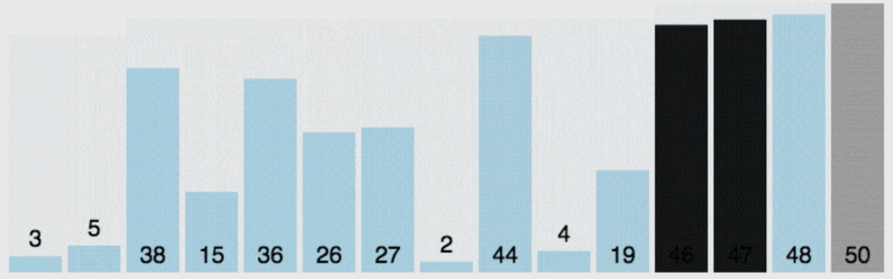
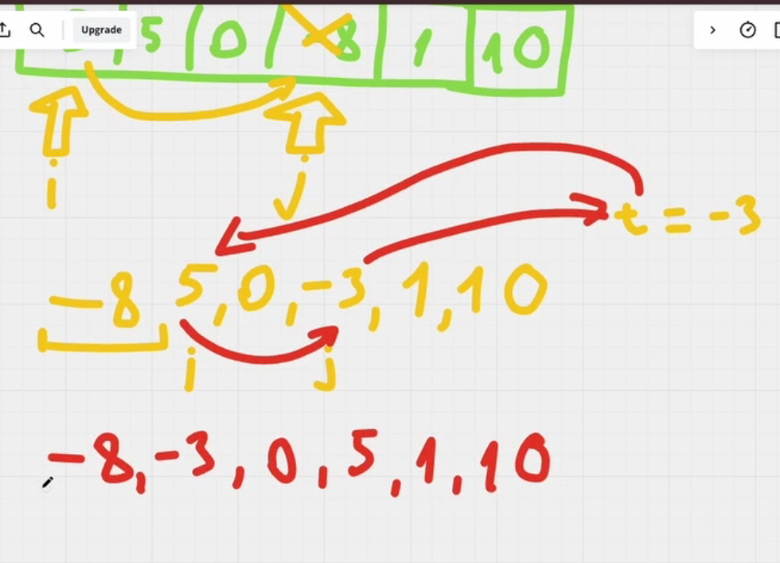
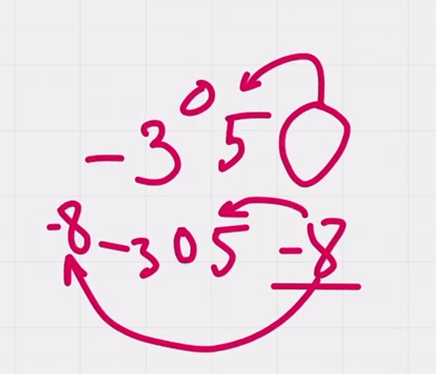
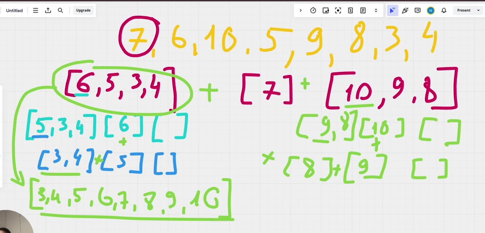

# OD03_Sorting_algorithms
 OD03.  Алгоритмы сортировки

✅Сортировка — это процесс упорядочивания элементов 
множества в определенном порядке, таком как возрастание
или убывание. 
Этот процесс является одной из базовых операций 
в программировании и используется в различных приложениях,
таких как поиск, обработка данных и оптимизация.

Пузырьковая сортировка (Bubble Sort);

Сортировка выбором (Selection Sort);

Сортировка вставками (Insertion Sort);

Быстрая сортировка (Quick Sort);

Сортировка слиянием (Merge Sort).

